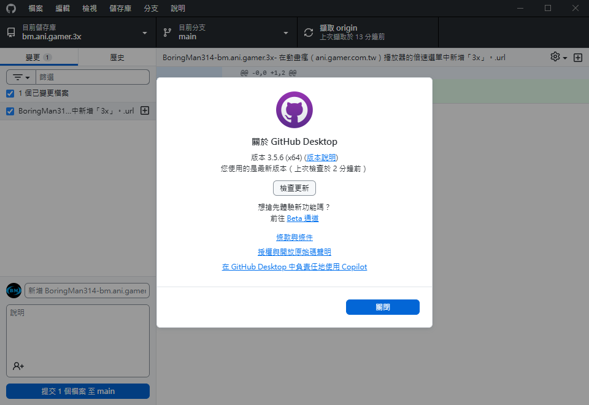

# [B.M] GitHub Desktop 正體中文化

本專案對應 **GitHub Desktop 3.5.6**（Windows）

以對照表將官方 `main.js`、`renderer.js` 內介面字串替換為**繁體中文**，產出檔置於 `Windows/`，覆蓋本機安裝目錄即可套用。



---

## 目錄

* [功能](#功能)
* [系統需求](#系統需求)
* [安裝方式](#安裝方式)
* [自行編譯與套用](#自行編譯與套用)
* [技術概要](#技術概要)
* [專案結構](#專案結構)
* [版本與對照表維護](#版本與對照表維護)
* [疑難排解：白屏與卡住](#疑難排解白屏與卡住)
* [維護者：更新 GitHub](#維護者更新-github)
* [參考資料](#參考資料)
* [問題與建議](#問題與建議)

---

## 功能

* 將 **GitHub Desktop** 介面字串改為**正體中文**（選單、對話框、說明文字等，依對照表涵蓋範圍為準）。
* 透過 `Temp/UserTemp.zh` 維護英→中對照，由腳本批次套用至 `Orig/`，輸出至 `Windows/`。
* 升級官方程式後，可自新版安裝目錄更新 `Orig/` 並調整對照表後重新產生。

---

## 系統需求

* **Windows**
* **Python 3**（自行編譯、驗證對照表時需要）

---

## 安裝方式

1. 關閉 **GitHub Desktop**（必要時於工作管理員結束相關處理序）。
2. 將本專案 `Windows` 資料夾內的 **`main.js`**、**`renderer.js`** 複製到本機安裝路徑並覆蓋：
   `%LOCALAPPDATA%\GitHubDesktop\app-*\resources\app\`
3. 重新啟動 GitHub Desktop。

若遇權限問題，可嘗試以系統管理員身分執行：

`powershell -ExecutionPolicy Bypass -File scripts\copy_to_github_desktop.ps1`

---

## 自行編譯與套用

1. 從本機 **GitHub Desktop 安裝目錄**複製**未修改**的 `main.js`、`renderer.js`，覆蓋本專案 `Orig/main.js`、`Orig/renderer.js`（**版本須與實際安裝一致**）。
2. 編輯對照表 `Temp/UserTemp.zh`：每列格式為 `英文原文>*.*<譯文>*.*<分類>*.*<main.js 或 renderer.js>`，程式依「英文原文」做全文取代。
3. 於專案根目錄執行：`python scripts/validate_orig.py`
4. 執行：`python scripts/apply_zh_patch.py`（預設寫入 `Windows/main.js` 與 `Windows/renderer.js`）。
5. 將上述兩個檔複製到 `resources\app\` 覆蓋原版。

升級 GitHub Desktop 後，若官方改寫某句英文，對照表內對應「英文原文」也須一併更新，否則該句不會被替換。

更完整的版更流程與腳本說明見 [`scripts/README.md`](scripts/README.md)。

---

## 技術概要

* **對照表** `UserTemp.zh` 定義來源字串與譯文；**`apply_zh_patch.py`** 讀取 `Orig/` 與對照表，以較長字串優先替換，寫入 `Windows/`。
* **`validate_orig.py`** 檢查檔案存在、對照合理性與套用後結構（例如 `createElement` 數量），降低誤換導致白屏的風險。

---

## 專案結構

| 路徑 | 說明 |
|------|------|
| [`Orig/main.js`](Orig/main.js)、[`Orig/renderer.js`](Orig/renderer.js) | 自官方安裝目錄備份的未修改 bundle |
| [`Windows/main.js`](Windows/main.js)、[`Windows/renderer.js`](Windows/renderer.js) | 套用對照後產物，供覆蓋安裝目錄 |
| [`Temp/UserTemp.zh`](Temp/UserTemp.zh) | 英→中對照表 |
| [`scripts/`](scripts/) | `validate_orig.py`、`apply_zh_patch.py`、PowerShell 複製／驗證腳本等 |

---

## 版本與對照表維護

* 本 README 開頭所標 **對應 GitHub Desktop 版本** 請與 `Orig/` 實際來源一致。
* 換版時請**先**更新 `Orig/`，再跑 `validate` → 修正 `UserTemp.zh` → `apply`（細節見 `scripts/README.md`）。

---

## 疑難排解：白屏與卡住

1. **只覆蓋兩個檔**：僅替換 `resources\app\main.js` 與 `resources\app\renderer.js`，**勿**整包刪除或覆蓋整個 `app` 資料夾（缺少 `index.html`、`package.json` 等會白屏）。
2. **版本一致**：`Orig` 須與安裝目錄**同一版**；產物與 `app-3.5.x` 等路徑需對應。
3. **完全結束程式後再覆蓋**。
4. 本專案以 `validate_orig.py` 檢查套用後骨架；若仍白屏，於 GitHub Desktop 按 **Ctrl+Shift+I** 開啟開發者工具，查看 **Console** 第一則紅色錯誤。
5. **隔離測試**（判斷白屏來自 main 或 renderer）：
   * `python scripts/apply_zh_patch.py --main-only`
   * `python scripts/apply_zh_patch.py --renderer-only`  
   每次產生後覆蓋至 `resources\app\` 再重開測試。
6. **還原英文**：將安裝目錄內兩檔換回官方原版後若白屏消失，可確認與繁體檔案有關，再搭配上一項縮小範圍。

---

## 維護者：更新 GitHub

於專案根目錄：

```bash
git add README.md
git commit -m "docs: 更新 README"
git push origin main
```

---

## 參考資料

* GitHub Desktop 官網：https://desktop.github.com  
* GithubDesktopZhTool：https://github.com/robotze/GithubDesktopZhTool  
* GithubDesktopTW：https://github.com/NeKoOuO/GithubDesktopTW  

---

## 問題與建議

歡迎使用 [GitHub Issues](https://github.com/BoringMan314/bm-githubdesktop-tw/issues) 回報（請盡量附 GitHub Desktop 版本、作業系統與重現步驟）。
